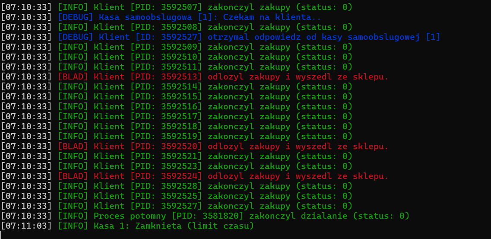
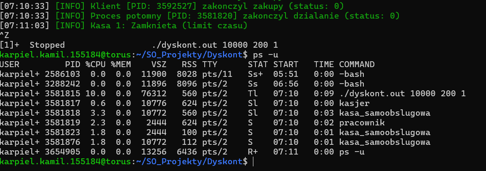
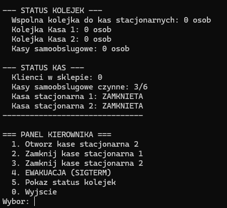
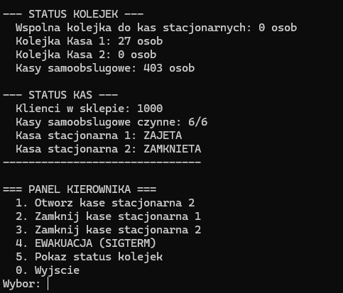
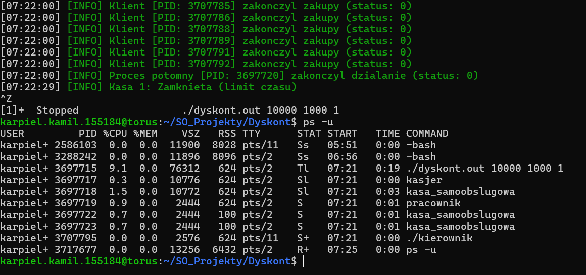
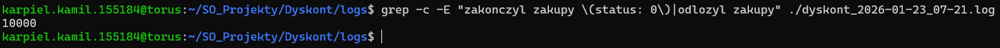
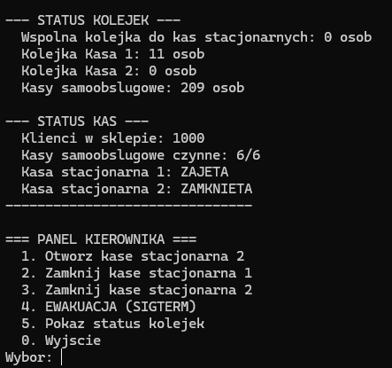
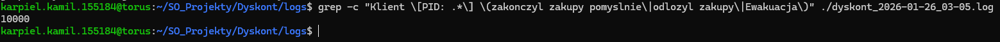
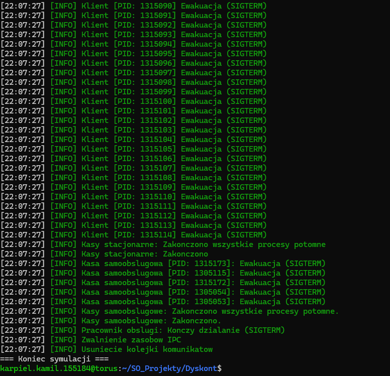
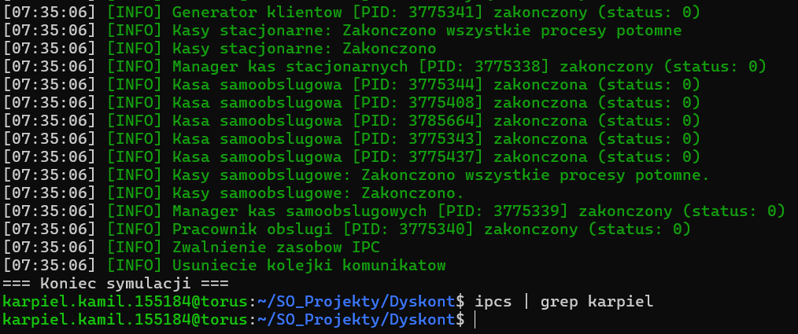

# Temat 16 - Dyskont [Raport Projektu]

**Kamil Karpiel**  
Grupa 1 | Studia stacjonarne | III semestr | Nr albumu 155184

> **Uwaga dotycząca logów:** W symulacji tag `[BLAD]` jest używany nie tylko do zgłaszania awarii programu, ale również do obsługi zdarzeń takich jak np. **weryfikacji wieku** (gdy niepełnoletni klient próbuje kupić alkohol). W takim przypadku tag `[BLAD]` oznacza odmowę sprzedaży.

## 0. Środowisko i kompilacja

Projekt został przetestowany w środowisku Linux (Torus) przy użyciu następujących narzędzi:

- **GCC**: 8.5.0
- **GNU Make**: 4.3

### Kompilacja

Aby skompilować projekt, należy wykonać polecenie:

```bash
make
```

### Uruchomienie

Składnia polecenia:

```bash
./dyskont.out <pula_klientow> <max_klientow_sklep> <nr_testu*>
```

**Argumenty:**

- `<pula_klientow>`: Całkowita liczba klientów do stworzenia w symulacji.
- `<max_klientow_sklep>`: Maksymalna liczba klientów przebywających jednocześnie w sklepie.
- `<nr_testu*>`: (Opcjonalne) Tryb testu: `0` = normalny (symulacja czasu zakupów), `1` = test obciążeniowy (bez opóźnień/sleepów). Domyślnie `0`.

### Wyświetlanie paragonów (Tryb Cichy)

Domyślnie program uruchamia klientów w trybie cichym (flaga `-quiet` w kodzie), aby nie zaśmiecać konsoli tysiącami paragonów.
Aby włączyć wyświetlanie paragonów dla każdego klienta należy:

1. Otworzyć plik `main.c`.
2. Znaleźć linię uruchamiającą proces `klient` (ok. linii 351).
3. Usunąć argument `"-quiet"` z funkcji `execl`.
4. Skompilować projekt ponownie (`make`).

### Obsługa Panelu Kierownika

Po uruchomieniu programu w osobnej konsoli (np. drugiej karcie terminala) można uruchomić panel sterowania:

```bash
./kierownik
```

Panel umożliwia interaktywne zarządzanie sklepem:

```text
=== PANEL KIEROWNIKA ===
  1. Otworz kase stacjonarna 2
  2. Zamknij kase stacjonarna 1
  3. Zamknij kase stacjonarna 2
  4. EWAKUACJA (SIGTERM)
  5. Pokaz status kolejek
  0. Wyjscie
Wybor:
```

## 1. Założenia projektu

Celem projektu było stworzenie symulacji działania **dyskontu**, opartej na **architekturze wieloprocesowej** (proces: _klienta_, _pracownika_, _kasjera_, _kasy samoobsługowej_ oraz sam _dyskontu_), a także na **wątkach** (_logów_ podpiętych do procesu głównego).
Komunikacja pomiędzy procesami jak i wątkami została zrealizowana z wykorzystaniem szeregu różnych **mechanizmów komunikacji międzyprocesowej (IPC)** wbudowanych w **system Linux**.

Szczegółowe wymagania dotyczące realizacji projektu znajdują się w pliku: https://github.com/MrKamkar/Dyskont/blob/main/README.md

## 2. Ogólny opis plików

Projekt został podzielony na moduły funkcjonalne:

- **main.c**: Główny proces zarządczy. Inicjalizuje zasoby IPC, a następnie uruchamia procesy-managery. Obsługuje sygnały systemowe i w przypadku ewakuacji uruchamia osobny **wątek sprzątający** (`WatekSprzatajacy`), który asynchronicznie zamyka procesy potomne, pozwalając procesowi głównemu na finalne zwolnienie zasobów IPC po zakończeniu wszystkich dzieci.

- **pamiec_wspoldzielona.c / .h**: Zawiera definicję struktury `StanSklepu` oraz funkcje zarządzające segmentem pamięci współdzielonej. Przechowuje ona tablicę statusów kas, liczniki klientów, flagi ewakuacji oraz magazyn produktów, umożliwiając wszystkim procesom dostęp do wspólnego stanu symulacji w czasie rzeczywistym.

- **semafory.c / .h**: Biblioteka do operacji na semaforach Systemu V. Implementuje między innymi semafory zliczające wolne miejsca w kolejkach komunikatów, co zapobiega systemowemu blokowaniu procesów przy przepełnieniu buforów kernela.

- **logi.c / .h**: System logowania oparty na dedykowanym wątku i kolejce komunikatów. Procesy przesyłają logi do kolejki, a wątek loggera (działający w procesie głównym) odbiera je, formatuje z użyciem kolorów ANSI i zapisuje do rotowanego pliku w katalogu `logs/`.

- **klient.c / .h**: Proces **Generatora Klientów**, który w pętli `fork`-uje właściwe procesy klientów. Każdy klient jest autonomicznym procesem. Klienci oczekujący w kolejce do kasy samoobsługowej uruchamiają pomocniczy **wątek sprawdzający**, który po czasie `T` monitoruje dostępność kas stacjonarnych i umożliwia migrację, jeśli te są wolne.

- **kasjer.c / .h**: Proces **Managera Kas Stacjonarnych**. Obsługuje Kasę 1 bezpośrednio, a w razie zapotrzebowania `fork`-uje proces Kasy 2. Posiada **wątek zarządzający**, który monitoruje wspólną kolejkę wejściową i rozdziela klientów do kolejek prywatnych konkretnych kas na podstawie ich długości i stanu.

- **kasa_samoobslugowa.c / .h**: Proces **Managera Kas Samoobsługowych**. Zarządza pulą procesów-robotów (Kasy 1-5). Posiada **wątek skalujący**, który dynamicznie tworzy nowe kasy (fork) lub wysyła sygnał `SIGUSR1` do istniejących w celu ich łagodnego zamknięcia, bazując na liczbie klientów w sklepie.

- **pracownik_obslugi.c / .h**: Proces **Pracownika**, który nasłuchuje na dedykowanej kolejce zadań. Odpowiada za losowe odblokowywanie zaciętych kas samoobsługowych oraz weryfikację wieku klientów kupujących alkohol (na podstawie wieku przekazanego w komunikacie).

- **kierownik.c / .h**: Interaktywny panel sterowania. Pozwala użytkownikowi na ręczne wysyłanie sygnałów `SIGUSR1/SIGUSR2` do procesu głównego (sterowanie kasami) oraz `SIGTERM` (ewakuacja).

- **kolejki.c / .h**: Warstwa abstrakcji nad IPC Message Queues. Implementuje bezpieczne wysyłanie komunikatów z użyciem semaforów oraz mechanizm **VIP (odpowiedzi)**, który gwarantuje dostarczenie komunikatu zwrotnego do klienta nawet przy pełnych kolejkach wejściowych.

### 3. Co udało się zrealizować?

- **Pełna symulacja wieloprocesowa**: Udalo się stworzyć stabilnie działający system symulujący pracę dyskontu, w którym każdy podmiot (kasjer, klient, kierownik, kasa samoobsługowa) jest osobnym procesem.

- **Bezpieczna obsługa sygnałów**: Wdrożono mechanizm obsługi sygnałów, gdzie handler przekazuje sygnały do procesów potomnych (np. ewakuacja) lub inicjuje wątek czyszczący, a właściwa logika sprzątania wykonywana jest poza handlerem.

- **Wątek loggera**: Zastosowanie osobnego wątku do logowania operacji (z kolejką komunikatów) znacząco odciążyło główne procesy, eliminując opóźnienia związane z operacjami wejścia/wyjścia.

- **Inteligentne zarządzanie kolejkami**: Klienci dynamicznie wybierają kasę (krótsza kolejka, stan kasy) oraz potrafią migrować do nowo otwartej kasy na sygnał kierownika.

- **Bezpieczne zamykanie aplikacji i czyszczenie zasobów IPC**: System poprawnie reaguje na sygnały różne zamykania aplikacji, rozpoczynając procedurę ewakuacji klientów, a następnie bezpiecznie kończy wszystkie procesy potomne i zwalnia zasoby IPC.

### 4. Z czym były problemy?

- **Procesy zombie**: Występował problem z niepoprawnym zliczaniem procesów potomnych. Rozwiązano to poprzez użycie `waitpid` w pętli z flagą `WNOHANG`, która umożliwia bezblokowe posprzątanie wszystkich zakończonych dzieci naraz w handlerze `SIGCHLD`, oraz na komunikację przez pipe z pętlą główną.

- **Deadlocki**: Zdarzały się, gdy procesy blokowały się na operacjach IPC podczas zamykania. Rozwiązano to poprzez zastosowanie **mechanizmu bezpiecznej obsługi sygnałów** oraz wdrożenie procedury, która przy zamykaniu aplikacji (SIGTERM) aktywnie przerywa oczekiwanie i sprząta zasoby.

- **Problemy z synchronizacją**: Początkowo projekt opierał się na kolejkach zaimplementowanych ręcznie w pamięci współdzielonej i semaforach, co prowadziło do trudnych asynchronicznych blędów w odczycie/zapisie kolejek. Problem rozwiązano poprzez całkowite przejście na **kolejki komunikatów**, które zapewniają spójność operacji na danych.

- **Aktywne oczekiwanie (Polling)**: Wstępna wersja projektu wykorzystywała pętle z `usleep()`, co niepotrzebnie obciążało procesor. Cały kod został przebudowany na **metody blokujące** (operacje na semaforach, oczekiwanie na komunikat w kolejce), dzięki czemu procesy czekają na zdarzenie, zamiast aktywnie sprawdzać ich stan.

- **Przepełnienie kolejek**: Przy dużej liczbie równoczesnych klientów dochodziło do zapychania się kolejek komunikatów, ponieważ brakowało obsługi tzw. komunikatu awaryjnego na odpowiedź. Procesy blokowały się, nie mogąc wysłać potwierdzenia do klienta. Rozwiązano to, dodając obsługę priorytetowych odpowiedzi (VIP), które gwarantują dostarczenie wiadomości z powodu braku ograniczeń na semaforach.

### 5. Mechanizmy synchronizacji i IPC

**- Pamięć dzielona (`shmget`/ `shmat`):**
Obiekt `StanSklepu` jest mapowany przez każdy proces. Zawiera:

- Tablice struktur `Kasa` (statusy, liczniki kolejek).
- Liczniki globalne (liczba klientów w sklepie, flagi ewakuacji).
- Magazyn produktów.

**- Semafory (`semop`):**
Zestaw semaforów kontroluje dostęp do zasobów, zapobiegając niesynchronizowanemu dostępowi do danych:

- `MUTEX_PAMIEC_WSPOLDZIELONA`: Chroni modyfikację stanu sklepu (blokuje dostęp do pamięci współdzielonej).
- `MUTEX_KOLEJKI_VIP`: Synchronizuje operacje podnoszenia limitu kolejki dla odpowiedzi VIP.
- `SEM_NOWY_KLIENT`: Sygnalizuje nowego klienta dla wątku skalującego kas samoobsługowych.

**- Kolejki komunikatów (`msgrcv`/`msgsnd`):**

Umożliwiają dwukierunkową wymianę danych między procesami:

- **Osobne kolejki + Wspólna Kolejka:** Klienci decydujący się na kasę stacjonarną wysyłają zgłoszenie do `ID_IPC_KASA_WSPOLNA`. **Wątek Zarządzający** (w procesie `kasjer`) odbiera te zgłoszenia i przekierowuje je do prywatnych kolejek kas (`ID_IPC_KASA_1` lub `ID_IPC_KASA_2`) w zależności od ich obciążenia i dostępności.

- **Informacja zwrotna:** Klient nasłuchuje na kanale `MSG_RES_STACJONARNA_BASE + id_klienta` (dla kas stacjonarnych) lub `MSG_RES_SAMOOBSLUGA_BASE + id_klienta` (dla kas samoobsługowych). Dzięki temu odbiera komunikat skierowany wyłącznie do niego. W odpowiedzi otrzymuje ID kasy, która go obsłużyła.

- **Mechanizm VIP:** Funkcja `WyslijKomunikatVIP` tymczasowo podnosi limit kolejki, by zagwarantować miejsce na odpowiedź nawet przy pełnej kolejce.

- **Logowanie nieblokujące:** Procesy wysyłają logi do kolejki loggera z flagą `IPC_NOWAIT`, dzięki czemu symulacja nie zatrzymuje się w oczekiwaniu na zapis na dysk.

## 6. Kluczowe Pseudokody

### 1. main.c (Proces Główny)

```
Inicjalizacja:
    utworz_pamiec_wspoldzielona()
    utworz_semafory()
    utworz_kolejki_komunikatow()
    uruchom_watek_loggera()

Uruchamianie Managerów:
    fork() -> exec("kasjer")             // Manager Kas Stacjonarnych + Kasa 1
    fork() -> exec("kasa_samoobslugowa") // Manager Kas Samoobsługowych + Kasa 0
    fork() -> exec("pracownik")          // Pracownik Obsługi
    fork() -> exec("klient")             // Generator Klientów

Pętla główna:
    wait() // Czekanie na zakończenie procesów (lub sygnały)

Obsługa Sygnałów:
    SIGTERM -> Rozpocznij procedurę ewakuacji (kill SIGTERM do process group)
    SIGUSR1/2 -> Przekaż sygnał do Managera Kas Stacjonarnych
```

### 2. klient.c (Generator + Klient)

```
Generator (Proces Główny):
    WHILE pula_klientow > 0:
        fork() -> Proces Klienta
        sleep(losowy_czas)
        czekaj_na_wejscie(SEM_WEJSCIE_DO_SKLEPU)

Proces Klienta:
    zrob_zakupy()

    IF samoobsluga:
        StartWatekSprawdzajacy(Timeout -> Idz do stacjonarnej)
        Wyslij(MSG_SAMOOBSLUGA)
        Odbierz(MSG_RES_SAMO + ID)
        ZabijWatekSprawdzajacy()

    IF stacjonarna OR przekierowany:
        Wyslij(MSG_WSPOLNA) // Wspólna kolejka
        Odbierz(MSG_RES_STACJONARNA + ID)

    Wyjscie:
        Zwolnij(SEM_WEJSCIE)
        exit()
```

### 3. kasjer.c (Manager Kas Stacjonarnych)

```
Proces Główny (Kasa 1):
    StartWatekZarzadzajacy()
    WHILE TRUE:
        Odbierz(MSG_KASA_1) // Prywatna kolejka
        ObsluzKlienta()
        WyslijVIP(Odpowiedz)

Wątek Zarządzający:
    WHILE TRUE:
        Msg = Odbierz(MSG_WSPOLNA)

        IF (K1 zamknieta AND duza_kolejka):
            OtworzKase1()

        Decyzja = WybierzKrotszaKolejke(K1, K2)
        Przekieruj(Msg -> Decyzja)

        Migracja() // Opcjonalnie przenieś z K1 do K2 jeśli K2 pustsza
```

### 4. kasa_samoobslugowa.c (Manager Kas Samoobsługowych)

```
Proces Główny (Kasa 0):
    StartWatekSkalujacy()
    WHILE TRUE:
        ObsluzKlienta(0)

Wątek Skalujący:
    WHILE TRUE:
        Czekaj(SEM_NOWY_KLIENT)
        Wymagane = ObliczLiczbeKas(Klienci)

        IF Aktywne < Wymagane:
            fork() -> Nowa Kasa
        ELSE IF ZaDuzoKas:
            Wyslij(SIGUSR1 -> Kasa) // Łagodne zamykanie

        ZbierzZombie()
```

## 7. Wykonane testy

Poniżej przedstawiono zbiór testów weryfikujących poprawność działania mechanizmów IPC w symulacji.

### Test 1 – Test Obciążeniowy (Brak Deadlocków)

- **Polecenie**: `./dyskont.out 10000 200 1`
- **Opis**: Weryfikacja stabilności systemu przy ekstremalnie szybkiej generacji i obsłudze procesów (tryb bez `usleepów`). Test weryfikuje odporność na deadlocki, poprawne czyszczenie procesów zombie oraz poprawność działania algorytmu skalowania kas (+/- 1 kasa na każde K klientów, minimum 3).
- **Oczekiwany wynik**:
  1. Kasa swoje kończy działanie automatycznie po obsłużeniu wszystkich 10 000 klientów i upłynięciu czasu bezczynności.
  2. Brak procesów zombie (wszystkie procesy klientów są poprawnie odebrane przez `waitpid` w procesie głównym generatora).
  3. Weryfikacja logiki skalowania: Gdy liczba klientów w sklepie spadnie do 0, system dynamicznie przez wątek skalujący redukuje liczbę kas samoobsługowych do poziomu 3, zgodnie z wzorem $klientów < K \cdot (N-3)$.
  4. Brak komunikatów błędów IPC na standardowym wyjściu błędów.
  5. `kierownik` (opcja 5) pokazuje na koniec 0 klientów w sklepie oraz powrót do 3 czynnych kas samoobsługowych.

  
_Zrzut 1: Kasa kończy działanie po czasie bezczynności_

  
_Zrzut 2: Poprawne skalowanie kas (3 procesy) i brak procesów zombie_

  
_Zrzut 3: Kierownik pokazuje 0 klientów w sklepie oraz 3 czynne kasy samoobsługowe_

### Test 2 – Odporność na przepełnienie kolejek (VIP)

- **Polecenie**: `./dyskont.out 10000 1000 1`
- **Opis**: Test weryfikujący, czy system radzi sobie z lawinowym napływem komunikatów do kas samoobsługowych, gdzie kolejki mogą się przepełnić. Test sprawdza, czy mechanizm `WyslijKomunikatVIP` (zwiększanie limitu kolejki) pozwala zawsze odesłać odpowiedź.
- **Oczekiwany wynik**:
  1. Kasy samoobsługowe nie ulegają deadlockowi na operacji `msgsnd` mimo pełnej kolejki (blokujący `msgsnd` przechodzi, ponieważ komunikaty zwrotne VIP nie podlegają limitowaniu przez semafory).
  2. Wszystkie 10 000 klientów otrzymuje swoje paragony.
  3. Kierownik raportuje pełne kolejki (domyślnie 408 komunikatów [16384B / 40B - 1]), ale system nadal przetwarza klientów bez utraty danych.

  
_Zrzut 1: Prawie pełne obłożenie kolejek (~403 komunikatów) a system nadal działa_

  
_Zrzut 2: Program nie zostawia żadnych procesów zombie_

  
_Zrzut 3: Wszystkie 10 000 klientów dostało swoje paragony (brak utraty danych)_

### Test 3 – Ręczne zarządzanie kasami w szczycie (Signały)

- **Polecenie**: `./dyskont.out 10000 1000 0` + użycie `kierownik` (opcje 1-3)
- **Opis**: Weryfikacja stabilności systemu, gdy podczas obsługi 10 000 klientów. Kierownik dynamicznie otwiera i zamyka kasy stacjonarne. Sprawdza poprawność przekierowywania klientów przez wątek zarządcy kas w momencie nagłej zmiany stanu kasy.
- **Oczekiwany wynik**:
  1. Zamknięcie kasy (status `KASA_ZAMYKANA`) powoduje dokończenie obsługi wszystkich klientów z jej prywatnej kolejki, a następnie całkowite wyłączenie (`KASA_ZAMKNIETA`).
  2. Wątek Zarządcy natychmiast przestaje kierować nowych klientów do zamykanej kasy, przekierowując ich do drugiej kasy lub pozostawiając w kolejce wspólnej (gdzie oczekują np. na automatyczne otwarcie Kasy 1).
  3. Otwarcie kasy powoduje natychmiastowe przejęcie części ruchu i rozładowanie kolejki wspólnej tak, by klient wybrał najmniejszą kolejkę.
  4. System działa stabilnie – nie zawiesza się (deadlock) i nie kończy niespodziewanie błędem segmentacji (segfault) mimo intensywnych zmian konfiguracji kas.

  
_Zrzut 1: Stan początkowy - stabilna praca, Kasa 1 obsługuje klientów_

  
_Zrzut 2: Zamknięcie kas - Kasa 1 zamykana, klienci gromadzą się we wspólnej kolejce_

  
_Zrzut 3: Interwencja - otwarcie Kasy 2 powoduje rozładowanie zatoru z kolejki samoobsługowej_

### Test 4 – Ewakuacja przy maksymalnym obciążeniu

- **Polecenie**: `./dyskont.out 10000 1000 1` -> Wywołanie Ewakuacji (przez `kierownik`, `kill -SIGTERM` lub `CTRL + C`)
- **Opis**: Sprawdzenie czy system potrafi bezpiecznie i całkowicie posprzątać zasoby w momencie największego obciążenia (tysiące aktywnych procesów klientów i procesów obsługujących kasy).
- **Oczekiwany wynik**:
  1. Główny proces natychmiast wysyła SIGTERM do grupy procesów.
  2. Wszystkie procesy (3 managery + tysiące klientów) kończą się w ciągu kilku sekund.
  3. Polecenie `ipcs` wykazuje brak wiszących kolejek, semaforów i pamięci współdzielonej.
  4. Brak procesów zombie (wszystkie poprawnie odebrane przez `wait`).

  
_Zrzut 1: Uruchomienie procedury ewakuacji (SIGTERM) przy pełnym obciążeniu sklepu_

  
_Zrzut 2: Potwierdzenie czystego środowiska (brak wiszących zasobów IPC) po zakończeniu programu_

## 8. Linki do kodu (Wymagane funkcje systemowe)

Poniżej znajdują się odniesienia do kluczowych mechanizmów systemowych wykorzystanych w projekcie (linki wskazują na konkretny commit `12eb908`):

**a. Tworzenie i obsługa plików (`open`, `close`, `write`)**

- `open` (otwarcie pliku logów): [logi.c:30-41](https://github.com/MrKamkar/Dyskont/blob/12eb908623b44b7a95c08f7f4a0ba0c812521ca8/Dyskont/logi.c#L30-L41)
- `read` (odczyt z pliku/urządzenia): [semafory.c:17-18](https://github.com/MrKamkar/Dyskont/blob/12eb908623b44b7a95c08f7f4a0ba0c812521ca8/Dyskont/semafory.c#L17-L18)
- `write` (zapis do logu): [logi.c:101-105](https://github.com/MrKamkar/Dyskont/blob/12eb908623b44b7a95c08f7f4a0ba0c812521ca8/Dyskont/logi.c#L101-L105)
- `close` (zamknięcie pliku): [logi.c:109](https://github.com/MrKamkar/Dyskont/blob/12eb908623b44b7a95c08f7f4a0ba0c812521ca8/Dyskont/logi.c#L109)

**b. Tworzenie procesów (`fork`, `exec`, `exit`, `wait`)**

- `fork` (tworzenie procesu generatora klientów): [main.c:339-345](https://github.com/MrKamkar/Dyskont/blob/12eb908623b44b7a95c08f7f4a0ba0c812521ca8/Dyskont/main.c#L339-L345)
- `exec` (`execl` - nadpisanie obrazu procesu): [main.c:287-291](https://github.com/MrKamkar/Dyskont/blob/12eb908623b44b7a95c08f7f4a0ba0c812521ca8/Dyskont/main.c#L287-L291)
- `exit` (`_exit` - zakończenie procesu potomnego): [main.c:291](https://github.com/MrKamkar/Dyskont/blob/12eb908623b44b7a95c08f7f4a0ba0c812521ca8/Dyskont/main.c#L291)
- `wait` (`waitpid` - oczekiwanie na dzieci): [main.c:364-370](https://github.com/MrKamkar/Dyskont/blob/12eb908623b44b7a95c08f7f4a0ba0c812521ca8/Dyskont/main.c#L364-L370)

**c. Tworzenie i obsługa wątków (`pthread_create`, `pthread_join`, `pthread_exit`)**

- `pthread_create` (utworzenie wątku loggera): [logi.c:130-134](https://github.com/MrKamkar/Dyskont/blob/12eb908623b44b7a95c08f7f4a0ba0c812521ca8/Dyskont/logi.c#L130-L134)
- `pthread_join` (oczekiwanie na wątek sprzątający): [main.c:165](https://github.com/MrKamkar/Dyskont/blob/12eb908623b44b7a95c08f7f4a0ba0c812521ca8/Dyskont/main.c#L165)
- `pthread_exit` (zakończenie wątku): [logi.c:110](https://github.com/MrKamkar/Dyskont/blob/12eb908623b44b7a95c08f7f4a0ba0c812521ca8/Dyskont/logi.c#L110)
- `pthread_sigmask` (blokowanie sygnałów w wątku): [logi.c:20-21](https://github.com/MrKamkar/Dyskont/blob/12eb908623b44b7a95c08f7f4a0ba0c812521ca8/Dyskont/logi.c#L20-L21)

**d. Obsługa sygnałów (`kill`, `signal`, `sigaction`)**

- `signal` (rejestracja handlerów sygnałów): [main.c:218-222](https://github.com/MrKamkar/Dyskont/blob/12eb908623b44b7a95c08f7f4a0ba0c812521ca8/Dyskont/main.c#L218-L222)
- `sigaction` (rejestracja handlera w kierowniku): [kierownik.c:100-103](https://github.com/MrKamkar/Dyskont/blob/12eb908623b44b7a95c08f7f4a0ba0c812521ca8/Dyskont/kierownik.c#L100-L103)
- `kill` (wysłanie sygnału do grupy procesów): [kierownik.c:129-130](https://github.com/MrKamkar/Dyskont/blob/12eb908623b44b7a95c08f7f4a0ba0c812521ca8/Dyskont/kierownik.c#L129-L130)

**e. Synchronizacja procesów (Semafory Systemu V)**

- `semget` (utworzenie/pobranie zestawu semaforów): [semafory.c:56-64](https://github.com/MrKamkar/Dyskont/blob/12eb908623b44b7a95c08f7f4a0ba0c812521ca8/Dyskont/semafory.c#L56-L64)
- `semop` (operacja na semaforze - wait/signal): [semafory.c:41-44](https://github.com/MrKamkar/Dyskont/blob/12eb908623b44b7a95c08f7f4a0ba0c812521ca8/Dyskont/semafory.c#L41-L44)
- `semctl` (ustawienie wartości/usunięcie): [semafory.c:112-114](https://github.com/MrKamkar/Dyskont/blob/12eb908623b44b7a95c08f7f4a0ba0c812521ca8/Dyskont/semafory.c#L112-L114)

**f. Segmenty pamięci dzielonej (`shmget`, `shmat`, `shmdt`, `shmctl`)**

- `ftok` (generowanie unikalnego klucza IPC): [pamiec_wspoldzielona.c:171-177](https://github.com/MrKamkar/Dyskont/blob/12eb908623b44b7a95c08f7f4a0ba0c812521ca8/Dyskont/pamiec_wspoldzielona.c#L171-L177)
- `shmget` (alokacja segmentu pamięci): [pamiec_wspoldzielona.c:27-35](https://github.com/MrKamkar/Dyskont/blob/12eb908623b44b7a95c08f7f4a0ba0c812521ca8/Dyskont/pamiec_wspoldzielona.c#L27-L35)
- `shmat` (dołączenie segmentu do przestrzeni adresowej): [pamiec_wspoldzielona.c:38-42](https://github.com/MrKamkar/Dyskont/blob/12eb908623b44b7a95c08f7f4a0ba0c812521ca8/Dyskont/pamiec_wspoldzielona.c#L38-L42)
- `shmdt` (odłączenie segmentu): [pamiec_wspoldzielona.c:75](https://github.com/MrKamkar/Dyskont/blob/12eb908623b44b7a95c08f7f4a0ba0c812521ca8/Dyskont/pamiec_wspoldzielona.c#L75)
- `shmctl` (usunięcie segmentu): [pamiec_wspoldzielona.c:85](https://github.com/MrKamkar/Dyskont/blob/12eb908623b44b7a95c08f7f4a0ba0c812521ca8/Dyskont/pamiec_wspoldzielona.c#L85)

**g. Kolejki komunikatów (`msgget`, `msgsnd`, `msgrcv`, `msgctl`)**

- `msgget` (utworzenie kolejki): [kolejki.c:21-30](https://github.com/MrKamkar/Dyskont/blob/12eb908623b44b7a95c08f7f4a0ba0c812521ca8/Dyskont/kolejki.c#L21-L30)
- `msgsnd` (wysłanie komunikatu): [kolejki.c:46-63](https://github.com/MrKamkar/Dyskont/blob/12eb908623b44b7a95c08f7f4a0ba0c812521ca8/Dyskont/kolejki.c#L46-L63)
- `msgrcv` (odebranie komunikatu): [kolejki.c:66-79](https://github.com/MrKamkar/Dyskont/blob/12eb908623b44b7a95c08f7f4a0ba0c812521ca8/Dyskont/kolejki.c#L66-L79)
- `msgctl` (statystyki kolejki): [kolejki.c:81-89](https://github.com/MrKamkar/Dyskont/blob/12eb908623b44b7a95c08f7f4a0ba0c812521ca8/Dyskont/kolejki.c#L81-L89)
